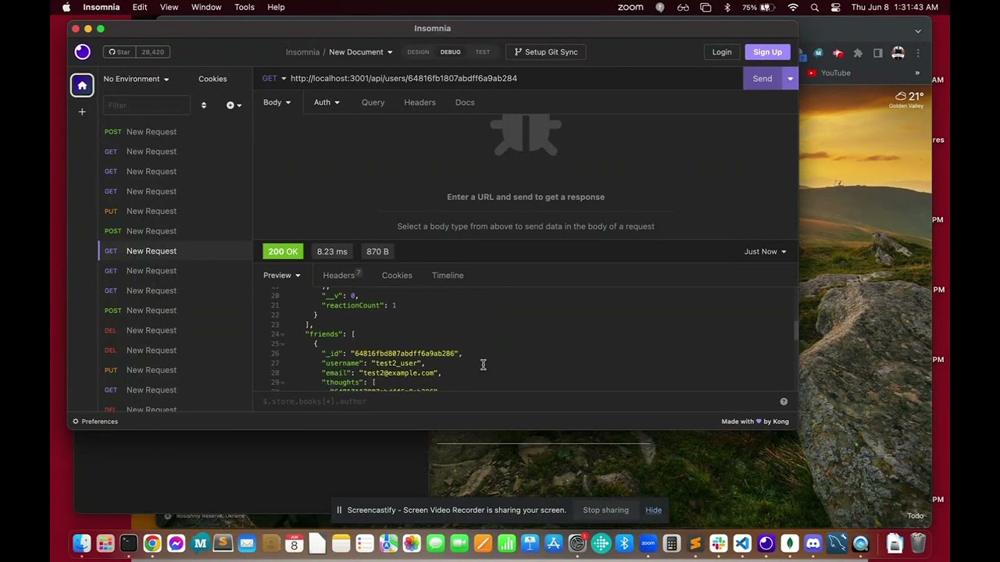

# umn-edx-nosql-social-network-api

## SUMMARY
This is a proof of concept for a social networking API.  It demonstrates how an administrator (with the help of another app to interact directly with the API) can manage users, "thoughts" (or posts), and "reactions" (or comments).

## SETUP AND EXECUTION
After cloning down this repository and running `npm install` from the terminal in the resulting path, you can simply run `npm run start` to execute the app.  There is no need to seed the database.

To exit the app, you can press *Ctrl + C*.

## NOTES
This is simply a concept, so there aren't rigorous checks and cascading deletions for any operation.  For instance, there is no security check to view the list of users or to post a thought as a particular user.

In addition, the deletion of a user does not remove that user's id from the list of friends of any other user.

There are also no checks to ensure that, during the add of a friend, that friend's id isn't already on the list of the user's friend list.  Should this be built out, that can easily be achieved, but again this is just a concept.

## DEMO
You can view a demo of the app on [YouTube](https://www.youtube.com/watch?v=USN0FvfViAQ).

